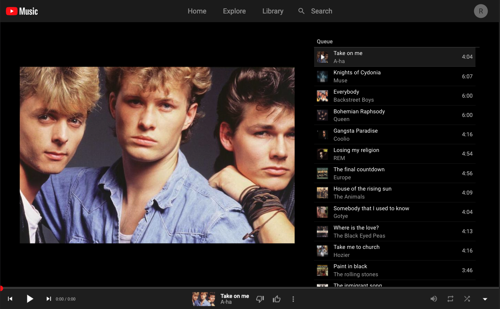
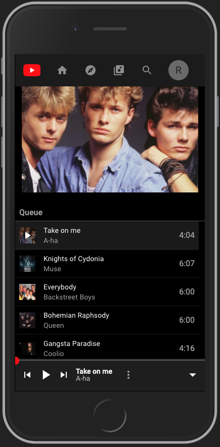

# Youtube Music Clone

Clone of Youtube Music, built with React.

## Tools used

- [React](https://reactjs.org/) - Frontend library
- [Material-UI](https://material-ui.com/) - UI library
- [Styled Components](https://styled-components.com/) - CSS-in-JS library
- [Howler](https://howlerjs.com/) - Audio Library
- [Redux-toolkit](https://redux-toolkit.js.org/) - State Management

## Desktop preview


## Mobile preview


## Getting started

To run the project:

1. Clone the repo

```sh
git clone https://github.com/gersongams/YT-music-clone
```

2. Install the dependencies

```sh
npm install # Or use yarn
```

3. To run the project:

```sh
yarn start
```

Go to the http://localhost:3000 and test the app

## TODO
- [x] Creating layouts
- [x] Implement state management
- [x] Adding audio library
- [x] Mobile-UI
- [ ] Loading state

## Demo

There is a demo for this application running in [https://yt-music-clone.netlify.app/](https://yt-music-clone.netlify.app/)

## Authors

Gerson garrido [@gersongams](https://github.com/gersongams/)
